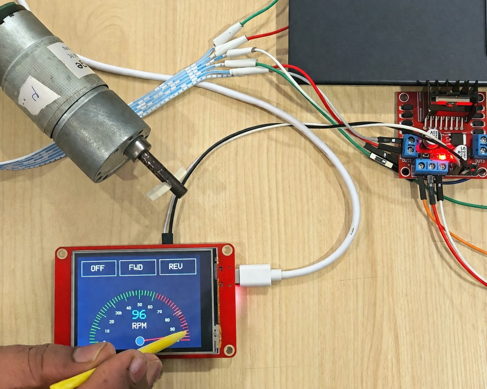

# esp32-encoder-motor-control

# ESP32 WROOM Based Encoder Motor Control with TFT Display Interface

##  Overview
This project demonstrates a complete embedded motor control system using ESP32 WROOM, integrating motor driving, encoder feedback, and a TFT display interface.

The system is designed to control a DC geared motor with smooth speed ramping, bidirectional movement, and real-time feedback capability, forming the foundation for closed-loop control systems.

---

##  Features

- Bidirectional motor control (Forward / Reverse)
- Speed ramping (slow → fast) using software PWM
- H-bridge motor driver interface (IN1 / IN2 control)
- Quadrature encoder input for pulse tracking
- TFT display interface for visualization (SPI-based)
- Modular and scalable code structure

---

##  Hardware Used

- ESP32 WROOM (CrowPanel / Dev Module)
- 12V DC Geared Motor with Encoder
- Motor Driver (L298N / similar H-bridge)
- TFT Display (ILI9341 based)
- External 12V Power Supply

---

##  Pin Configuration

### Motor Driver
| Function | ESP32 Pin |
|--------|----------|
| IN1    | GPIO16   |
| IN2    | GPIO17   |

### Encoder
| Function | ESP32 Pin |
|--------|----------|
| Channel A | GPIO32 |
| Channel B | GPIO25 |

### TFT Display (SPI)
| Function | ESP32 Pin |
|--------|----------|
| SCK | GPIO14 |
| MOSI | GPIO13 |
| MISO | GPIO12 |
| CS | GPIO15 |
| DC | GPIO2 |

---

##  Working Principle

- Motor direction is controlled using IN1 and IN2 pins of the driver.
- Speed variation is achieved using software-based PWM.
- Encoder signals are captured using interrupts to track rotation pulses.
- TFT display is used to visualize system status and future real-time data.

---

##  Future Improvements

- Real-time RPM calculation using encoder feedback
- Closed-loop speed control (PID)
- Hardware PWM (LEDC) for smoother speed control
- Touch-based UI for interactive control
- Data logging and performance monitoring

---

##  Getting Started

1. Connect hardware as per pin configuration
2. Upload the code using Arduino IDE (ESP32 board selected)
3. Power the motor using external 12V supply
4. Open Serial Monitor to observe system behavior

---

##  Notes

- Ensure common ground between ESP32 and motor driver
- Do not power motor directly from ESP32
- Encoder voltage should match ESP32 logic (3.3V recommended)

---

## 📷 Preview

